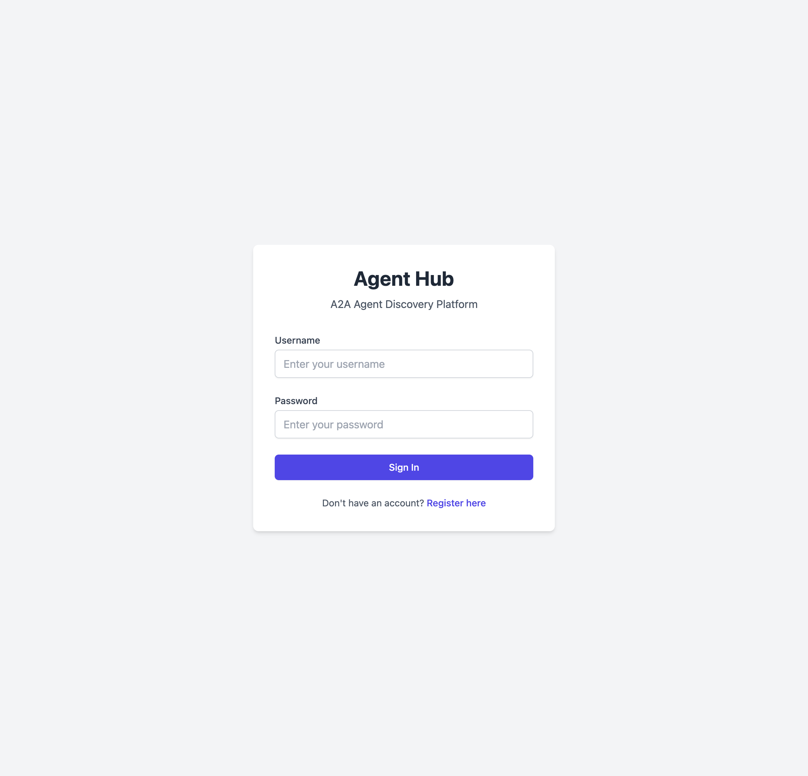
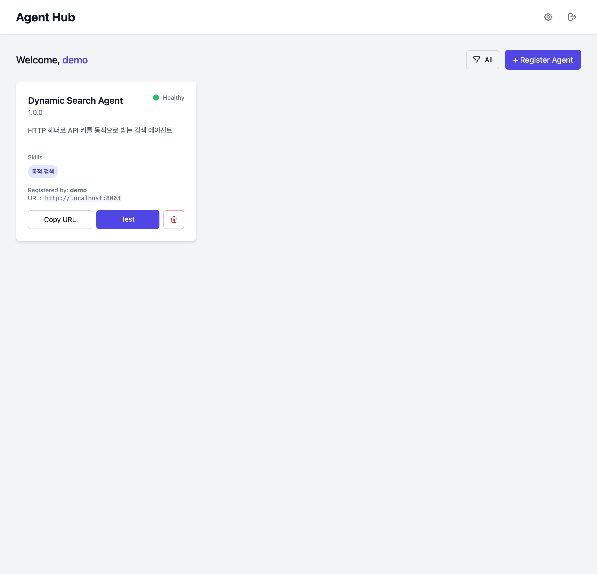
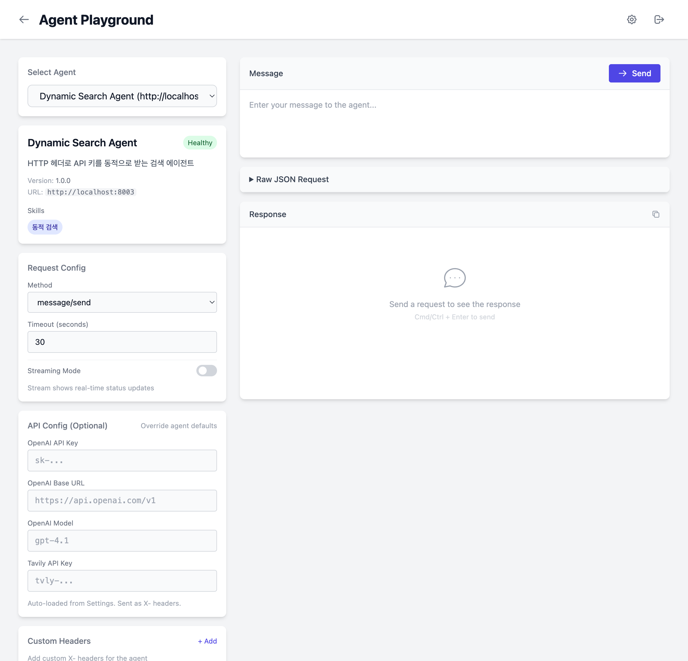

<p align="center">
  <h1 align="center">Agent Hub</h1>
  <p align="center">
    <strong>Run any A2A agent with your own API keys</strong>
  </p>
  <p align="center">
    A2A 에이전트를 내 API 키로 실행하는 플랫폼
  </p>
</p>

<p align="center">
  <a href="#features">Features</a> •
  <a href="#quick-start">Quick Start</a> •
  <a href="#screenshots">Screenshots</a> •
  <a href="#how-it-works">How It Works</a> •
  <a href="#for-agent-developers">For Developers</a>
</p>

---

## Why Agent Hub?

A2A 에이전트를 공유할 때 가장 큰 문제는 **API 키**입니다.

- 에이전트 제공자가 키를 넣으면 → 비용 부담, 보안 위험
- 사용자가 코드를 수정하면 → 번거롭고 업데이트 어려움

**Agent Hub는 이 문제를 해결합니다:**

```
You (API Keys) + Someone's Agent (Logic) = Working AI Agent
```

## Features

- 🔑 **Bring Your Own Keys** — OpenAI, Anthropic, Tavily 등 본인 API 키 사용
- 🤖 **Agent Marketplace** — 다른 사람이 만든 에이전트 등록 및 사용
- 🎮 **Playground** — 브라우저에서 바로 에이전트 테스트
- 📊 **Observability** — Langfuse 연동으로 트레이싱 지원
- 🔒 **Secure** — API 키는 요청 시에만 전달, 서버 저장 없음

## Quick Start

```bash
# Install
git clone https://github.com/BAEM1N/a2a_agent_hub.git
cd a2a_agent_hub
pip install -r requirements.txt  # or: uv sync

# Run
python main.py
```

Open http://localhost:8000

## Screenshots

<table>
  <tr>
    <td align="center"><b>Login</b></td>
    <td align="center"><b>Dashboard</b></td>
  </tr>
  <tr>
    <td></td>
    <td></td>
  </tr>
</table>

<p align="center">
  
  <br/>
  <em>Agent Playground - 에이전트 테스트 화면</em>
</p>

## How It Works

```
┌─────────────────────────────────────────────────────────────────┐
│                         Agent Hub                                │
│  ┌───────────┐    ┌───────────┐    ┌───────────┐               │
│  │  Profile  │    │ Dashboard │    │Playground │               │
│  │  (Keys)   │    │ (Agents)  │    │  (Test)   │               │
│  └─────┬─────┘    └───────────┘    └─────┬─────┘               │
│        │                                  │                      │
│        └──────────┬───────────────────────┘                      │
│                   ▼                                              │
│         X-OpenAI-API-Key: sk-xxx                                │
│         X-Langfuse-Secret-Key: xxx                              │
└───────────────────┬─────────────────────────────────────────────┘
                    │
                    ▼ HTTP Request + Headers
┌───────────────────────────────────────────────────────────────────┐
│                      A2A Agent (External)                         │
│                                                                   │
│   • Wrapped with langgraph-a2a-adapters                          │
│   • Receives API keys via state.api_config                       │
│   • No hardcoded credentials                                      │
└───────────────────────────────────────────────────────────────────┘
```

**Key Points:**
1. 사용자는 Profile에서 API 키 설정
2. Playground에서 에이전트 호출 시 HTTP 헤더로 키 전달
3. 에이전트는 `state.api_config`에서 키를 받아 사용

## For Agent Developers

Agent Hub와 호환되는 에이전트를 만들려면:

### 1. Requirements

| Requirement | Description |
|-------------|-------------|
| **langgraph-a2a-adapters** | A2A 프로토콜 어댑터 사용 |
| **Dynamic Config** | State에서 `api_config` 수신 |
| **Public URL** | 외부 접근 가능한 엔드포인트 |

### 2. Example Agent

```python
from typing import TypedDict, Optional
from langchain_openai import ChatOpenAI
from langgraph.graph import StateGraph

class AgentState(TypedDict):
    query: str
    messages: list
    api_config: Optional[dict]  # ← Injected by adapter

def chat_node(state: AgentState):
    config = state.get('api_config') or {}

    # Use keys from state, not hardcoded
    llm = ChatOpenAI(
        api_key=config.get('OPENAI_API_KEY'),
        model=config.get('OPENAI_MODEL', 'gpt-4o'),
    )

    response = llm.invoke(state['query'])
    return {"messages": [response]}

# Build graph
graph = StateGraph(AgentState)
graph.add_node("chat", chat_node)
# ... compile and wrap with adapter
```

### 3. Network Requirements

```
❌ localhost:8003          → Agent Hub cannot reach
✅ https://agent.example.com  → Works
✅ https://xxx.ngrok.io       → Works
✅ 123.456.789.0:8003         → Works (public IP)
```

## API Reference

### Endpoints

| Method | Endpoint | Description |
|--------|----------|-------------|
| `GET` | `/api/agents` | List all agents |
| `POST` | `/api/agents` | Register agent |
| `DELETE` | `/api/agents/{id}` | Remove agent |
| `POST` | `/api/agents/{id}/test` | Test agent |
| `POST` | `/api/agents/{id}/stream` | Test with streaming |
| `GET` | `/api/settings` | Get user settings |
| `PUT` | `/api/settings` | Update settings |

### Supported Headers

| Header | Environment Variable |
|--------|---------------------|
| `X-OpenAI-API-Key` | `OPENAI_API_KEY` |
| `X-OpenAI-Model` | `OPENAI_MODEL` |
| `X-OpenAI-Base-Url` | `OPENAI_BASE_URL` |
| `X-Tavily-API-Key` | `TAVILY_API_KEY` |
| `X-Langfuse-Secret-Key` | `LANGFUSE_SECRET_KEY` |
| `X-Langfuse-Public-Key` | `LANGFUSE_PUBLIC_KEY` |

## Tech Stack

- **Backend**: FastAPI, SQLAlchemy, aiosqlite
- **Frontend**: Jinja2, Tailwind CSS
- **Auth**: Session-based with bcrypt

## Related Projects

- [langgraph-a2a-adapters](https://github.com/BAEM1N/langgraph_a2a_adapters) — LangGraph ↔ A2A protocol adapter

## License

MIT
